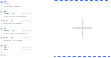

## vue-img-paste-upload(当前版本 V1.0.0)

一款高效、简洁、功能丰富、方便的 **图片** 上传插件

## Vue 兼容版本

Vue2.x

## 浏览器功能兼容版本

点击上传（ie10+）

粘贴上传（非 ie 等浏览器高版本，目前支持微信等截图粘贴）

## Install

```javascript
	npm i vue-img-paste-upload -S

	//main.js
	import vipu from "vue-img-paste-upload";
	Vue.use(vipu)

	//页面使用
	<vue-img-paste-upload
      ref="vipu"
      :active="active"
      :file-list="fileList"
      :max="3"
      :on-delete="hanldeDelete"
      :on-upload="handleUpload"
      @view="handleView"
      @exceed="exceed"
      @after-upload="afterUpload"
    ></vue-img-paste-upload>
    <button type="button" @click="active = !active">
      {{ active ? "关闭" : "启动" }}粘贴功能
    </button>

    data: () => {
        return {
            active: false,
            fileList: []
        }
    }
```

## ui 效果图



## Attribute

| 属性      | 类型     | 说明                                                                                             | 默认                    | 是否必传 |
| --------- | -------- | ------------------------------------------------------------------------------------------------ | ----------------------- | -------- |
| file-list | Array    | 文件数据                                                                                         | []                      | FALSE    |
| active    | Boolean  | 是否开启粘贴图片功能                                                                             | FALSE                   | FALSE    |
| zoom      | Boolean  | 是否显示放大图片按钮(若开启则点击执行 emit('view'))                                              | TRUE                    | FALSE    |
| readonly  | Boolean  | 是否只读                                                                                         | FALSE                   | FALSE    |
| multiple  | Boolean  | 是否多选                                                                                         | FALSE                   | FALSE    |
| max       | Number   | 限制文件数量                                                                                     | 1995                    | FALSE    |
| accept    | String   | 文件默认查询类型                                                                                 | .gif, .jpg, .jpeg, .png | FALSE    |
| on-upload | Function | 参数为上传的文件，若返回!=false 则直接删除； 或者返回 Promise ,则 reslove 后添加，否则不执行删除 |                         | FALSE    |
| on-delete | Function | 参数为上传的文件，若返回 false 或者返回 Promise 且被 reject，则停止删除                          |                         | FALSE    |

## on-upload

若有此方法，可返回 true 或 promise 进行判断是否执行添加，若你执行了 http 请求，则可以返回一个 promise 对象，此时 resolve 后执行添加，同时你可携带你需要的参数，以 object 方式返回，注意，若你想标记此图片已经上传，请务必传 already:true;如下示例

```
// return {
      //   already: true,
      //   id: "xx",
      // };

	  return new Promise((resolve) => {
        setTimeout(() => {
          resolve({
            already: true,
            id: "xx",
          });
        }, 1000);
      });

```

## 回调函数

| 函数名       | 说明                                                    | 返回值                                                                                                                                                                                                           |
| ------------ | ------------------------------------------------------- | ---------------------------------------------------------------------------------------------------------------------------------------------------------------------------------------------------------------- |
| view         | zoom 属性设置 true 时点击放大按钮图标可执行查看当前图片 | object，包括 file 对象及自定义参数                                                                                                                                                                               |
| exceed       | 当文件超出限定时返回当前超出的文件对象                  | object，包括 file 对象及自定义参数，针对有 on-upload 异步上传的延时性以及 max 判断时机，虽然前端数据未展示，但是有可能文件已上传到服务器，所以可针对此返回数据进行调用后台接口删除，ps->不推荐文件变更时直接上传 |
| after-upload | 执行完添加后的回调                                      | object，包括 file 对象及自定义参数                                                                                                                                                                               |
| after-delete | 执行完删除后的回调                                      | object，包括 file 对象及自定义参数                                                                                                                                                                               |

## API

| 函数名       | 说明                                                               | 参数格式 | 调用示例                       |
| ------------ | ------------------------------------------------------------------ | -------- | ------------------------------ |
| getNotUpload | 返回当前以 already 进行标记未执行上传到服务器的文件 ，类型为 Array | 无       | this.$refs.vipu.getNotUpload() |
| setUpload    | 对当前 fileList 数据标记已上传，以 already 为标记                  | 无       | this.$refs.vipu.setUpload()    |

## Other

1、后继会继续更新 vue3 版本

2、如果有其他问题邮件沟通1195669615@qq.com或者加 qq1195669615。若插件能够帮助到您，期待您的 star 哦！

3、欢迎加入 qq 交流群（目前正在起步中）


```
